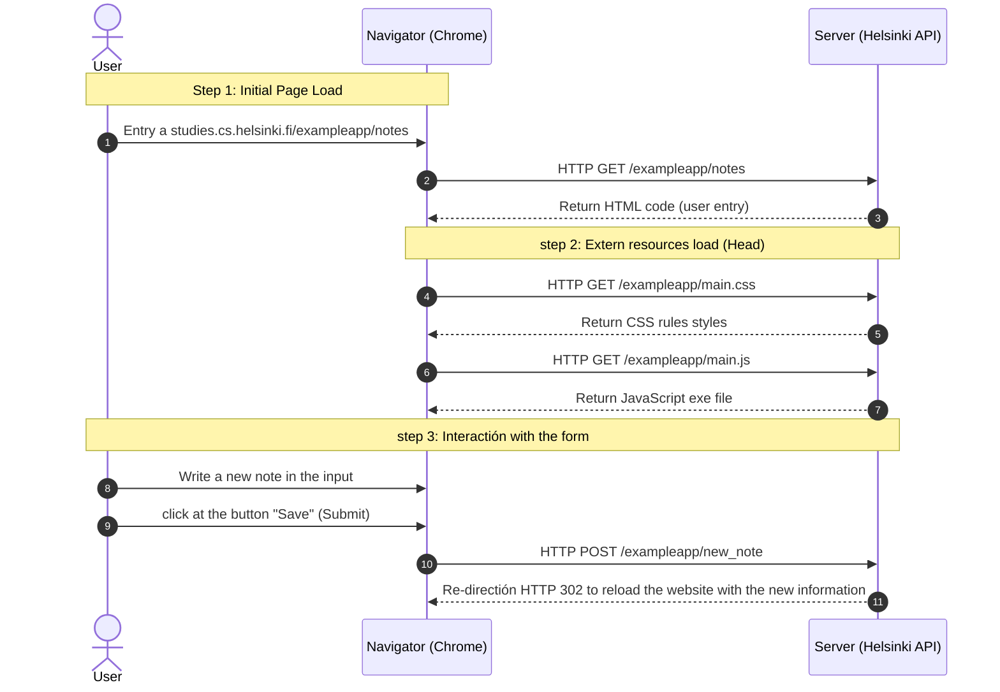

```mermaid
sequenceDiagram
    autonumber
    actor User
    participant Navigator as Navigator (Chrome)
    participant Server as Server (Helsinki API)

    Note over User,Navigator: Step 1: Initial Page Load
    User->>Navigator: Entry a studies.cs.helsinki.fi/exampleapp/notes
    Navigator->>Server: HTTP GET /exampleapp/notes
    Server-->>Navigator: Return HTML code (user entry)
    
    Note over Navigator,Server: step 2: Extern resources load (Head)
    Navigator->>Server: HTTP GET /exampleapp/main.css
    Server-->>Navigator: Return CSS rules styles
    Navigator->>Server: HTTP GET /exampleapp/main.js
    Server-->>Navigator: Return JavaScript exe file

    Note over User,Server: step 3: Interactión with the form
    User->>Navigator: Write a new note in the input
    User->>Navigator: click at the button "Save" (Submit)
    Navigator->>Server: HTTP POST /exampleapp/new_note
    Server-->>Navigator: Re-directión HTTP 302 to reload the website with the new information
```
